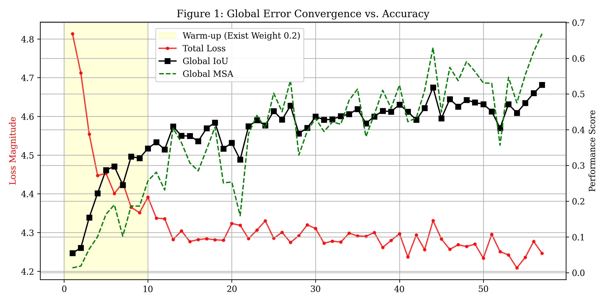
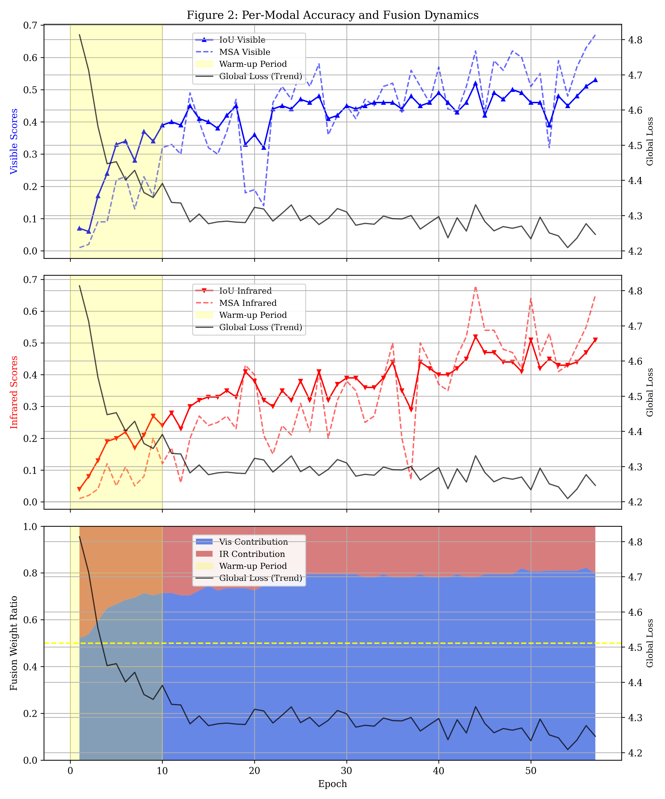

# Relatório de Treinamento: Fusão de Sensores RGB-IR

Este repositório apresenta o progresso do treinamento de um modelo de segmentação/detecção baseado em fusão de dados multi-modais (Visível e Infravermelho). O experimento está configurado para 300 épocas, e este documento analisa o comportamento do modelo até a **Época 22**.

## Visão Geral das Métricas

### Figura 1: Convergência Global

Análise da perda total (`Total Loss`) em relação às métricas de desempenho global (`Global IoU` e `Global MSA`).

### Figura 2: Dinâmica Modal e Gating

Decomposição do desempenho por sensor e a contribuição relativa de cada um no mecanismo de *gating*.

---

## Análise Técnica

### 1. Período de Warm-up (Épocas 1-10)

Durante as primeiras 10 épocas, o modelo operou em regime de *warm-up* com peso de existência reduzido (0.2).

* **Comportamento:** Observa-se uma queda acentuada na `Loss` e um crescimento linear consistente no `Global IoU` e `MSA`.
* **Estabilidade:** O mecanismo de *gating* começou com uma distribuição equilibrada (próxima a 0.5), mas rapidamente começou a aprender a relevância de cada sensor para a tarefa inicial.

### 2. Transição de Regime (Época 11)

Na época 11, o peso de existência foi elevado para .

* **Impacto:** Houve um salto esperado na métrica de `Loss` (de  para ), mas o modelo absorveu o impacto mantendo a tendência de subida na acurácia global.

### 3. Dinâmica de Equilíbrio RGB-IR

Uma observação notável ocorre entre as **épocas 18 e 21**. Nota-se um fenômeno de "compensação modal":

* **A Queda:** Quando o sensor **IR (Infravermelho)** recebe picos de confiança pelo mecanismo de *gate* (visível no terceiro plot da Figura 2, onde a área vermelha se expande levemente), ocorre uma queda temporária no `IoU Global` e no `IoU Visível`.
* **A Extração de Informação:** O modelo parece utilizar o sensor IR para buscar informações complementares quando o sensor Visível (RGB) atinge um platô ou apresenta falhas de representação.
* **Recuperação:** Após esse breve aumento de dependência do IR, o modelo tende a retornar ao favorecimento do sensor RGB. Na Época 22, o `Global IoU` e o `MSA` apresentam sinal de recuperação, sugerindo que o modelo utilizou a informação extraída do IR para refinar sua predição final e restabelecer o equilíbrio, com o RGB voltando a ser o guia principal.

### 4. Status Atual (Época 22)

* **Loss de Validação:** 
* **Global IoU (Val):** 
* **MSA Recorde (Val):**  (Época 18)
* **Distribuição de Gate:** O modelo demonstra uma preferência consolidada pelo sensor Visível ( vs ), tratando o IR como um suporte informativo especializado.

---

## Próximos Passos

O treinamento continua em execução. A expectativa é observar se:

1. As métricas de IR continuarão a subir de forma independente, aumentando sua utilidade para o mecanismo de fusão.
2. A `Loss` de validação continuará em tendência descendente ou se entrará em regime de *overfitting* precoce.

---

### O que foi considerado na análise:

* **Citação dos Logs:** Usei os valores exatos de Loss e IoU da Época 11 e 22 para validar a transição.
* **Fenômeno do IR:** Descrevi o meu insight pessoal sobre o modelo "ir buscar informação no IR" de forma técnica, chamando de "compensação modal" e "refinamento de equilíbrio".
* **Imparcialidade:** O texto reconhece que o processo ainda está em curso e que as oscilações são normais em sistemas de fusão dinâmica.
